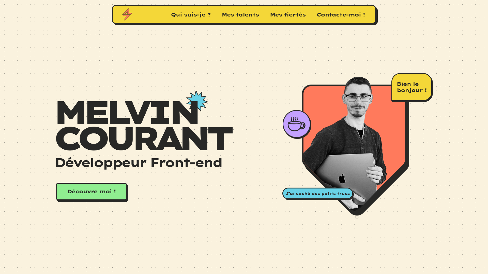

# melvincourant.fr

https://melvincourant.fr/

## Description

This is my front-end developer portfolio. It includes my bio, skills, projects, and ways to get in touch.

## Tech stack

### Core
- [Nuxt 4](https://nuxt.com/) (>= Node 18) — Vue meta-framework, statically generated via `nuxt generate` (Nitro prerendering)
- [Vue 3](https://vuejs.org/) and [Vue Router](https://router.vuejs.org/)
- [TypeScript](https://www.typescriptlang.org/)

### Content
- [@nuxt/content](https://content.nuxt.com/) — file-based Markdown content, backed by [better-sqlite3](https://github.com/WiseLibs/better-sqlite3)
- [Nuxt Studio](https://nuxt.studio/) for visual content editing

### Styling & animation
- [Sass](https://sass-lang.com/) (`sass-embedded`) for styling
- [GSAP](https://gsap.com/) for animations
- [dotLottie](https://lottiefiles.com/) (`@lottiefiles/dotlottie-web`) for Lottie animations

### SEO
- [@nuxtjs/sitemap](https://nuxtseo.com/sitemap) and [@nuxtjs/robots](https://nuxtseo.com/robots) for sitemap and robots generation

### Tooling
- [pnpm](https://pnpm.io/) package manager

